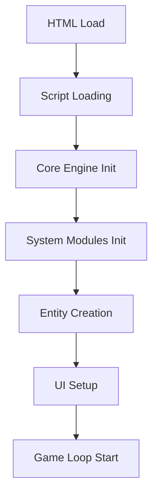
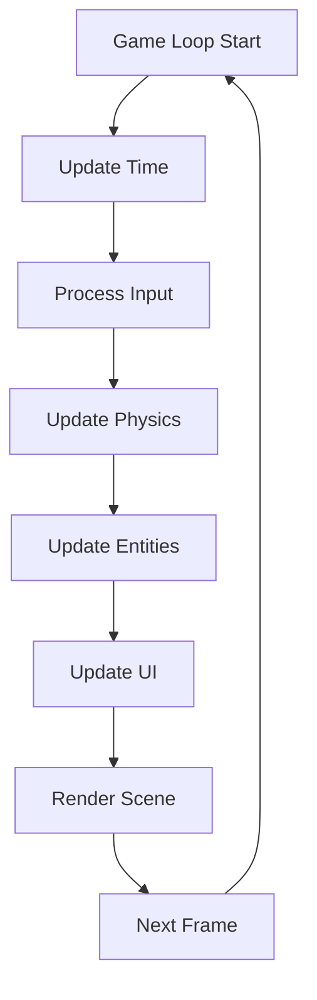
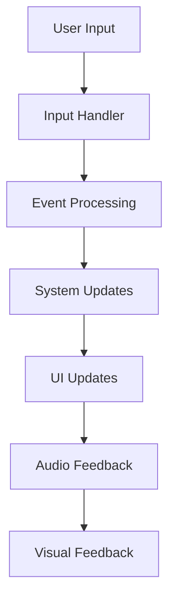

# SkyWorld - Mimari Dokümantasyonu

## 🏗️ Genel Mimari

SkyWorld modüler bir mimariye sahip web tabanlı 3D oyundur. Her sistem ayrı modülde organize edilmiştir ve loose coupling prensibi ile tasarlanmıştır.

## 📁 Klasör Yapısı

```
SkyWorld/
├── 📄 Ana Dosyalar
│   ├── index.html              # Version selector
│   └── skyworld-main.html      # Main game entry point
├── 📁 docs/                    # Documentation
│   ├── README.md              # Project overview
│   ├── FEATURES.md            # Feature documentation
│   ├── ARCHITECTURE.md        # This file
│   └── API.md                 # API documentation
├── 📁 src/                    # Source code
│   ├── core/                  # Core systems
│   ├── systems/               # Game systems
│   ├── entities/              # Game entities
│   ├── ui/                    # User interface
│   ├── utils/                 # Utilities
│   └── constants/             # Constants
├── 📁 assets/                 # Static assets
│   ├── sounds/                # Audio files
│   ├── textures/              # Textures
│   └── models/                # 3D models
├── 📁 dist/                   # Distribution
└── 📁 tests/                  # Test files
```

## 🎯 Tasarım Prensipleri

### 1. Modüler Mimari
- **Separation of Concerns:** Her modül tek sorumluluk
- **Loose Coupling:** Modüller arası düşük bağımlılık
- **High Cohesion:** İlişkili fonksiyonlar bir arada
- **Single Responsibility:** Her modül tek iş yapar

### 2. Performance First
- **Lazy Loading:** İhtiyaç duyulduğunda yükle
- **Efficient Rendering:** Optimize edilmiş render pipeline
- **Memory Management:** Aktif nesne takibi
- **Mobile First:** Mobil cihazlarda optimize

### 3. Scalability
- **Extensible Design:** Yeni özellikler kolayca eklenir
- **Configurable Systems:** Ayarlanabilir sistemler
- **Plugin Architecture:** Eklenti desteği hazır
- **API Driven:** Dış sistemlerle entegrasyon

## 🔧 Core Modüller

### Core Engine (`src/core/`)
```javascript
// Ana oyun motoru ve temel sistemler
├── engine.js           # Game loop ve initialization
├── scene.js            # Three.js scene management
├── camera.js           # Kamera kontrolü
└── renderer.js         # Rendering pipeline
```

**Responsibilities:**
- Game loop yönetimi
- Three.js entegrasyonu
- Performance monitoring
- System initialization

### Game Systems (`src/systems/`)
```javascript
// Oyun sistemleri
├── audio/              # Ses sistemi
│   ├── manager.js      # Audio yönetimi
│   ├── sounds.js       # Ses efektleri
│   └── music.js        # Arka plan müziği
├── inventory/          # Envanter sistemi
│   ├── manager.js      # Envanter yönetimi
│   ├── slots.js        # Slot yönetimi
│   └── items.js        # Eşya sistemi
├── physics/            # Fizik sistemi
│   ├── engine.js       # Fizik motoru
│   ├── gravity.js      # Yerçekimi
│   └── collisions.js   # Çarpışma sistemi
└── controls/           # Kontrol sistemi
    ├── manager.js      # Kontrol yönetimi
    ├── keyboard.js     # Klavye kontrolleri
    ├── mouse.js        # Mouse kontrolleri
    └── touch.js        # Touch kontrolleri
```

**Responsibilities:**
- Audio processing ve playback
- Inventory management ve stack handling
- Physics simulation ve collision detection
- Input handling (keyboard, mouse, touch)

### Game Entities (`src/entities/`)
```javascript
// Oyun nesneleri
├── player.js           # Oyuncu kontrolü
├── blocks/             # Blok sistemi
│   ├── manager.js      # Blok yönetimi
│   ├── types.js        # Blok tipleri
│   └── interactions.js # Blok etkileşimleri
└── world/              # Dünya sistemi
    ├── islands.js      # Ada oluşturma
    ├── structures.js   # Yapılar
    └── generation.js   # Dünya oluşturma
```

**Responsibilities:**
- Player character control
- Block creation, management, interaction
- World generation (islands, structures)

### User Interface (`src/ui/`)
```javascript
// Kullanıcı arayüzü
├── panels/             # UI panelleri
│   ├── inventory.js    # Envanter paneli
│   ├── info.js         # Bilgi paneli
│   ├── notifications.js# Bildirimler
│   └── controls.js     # Kontrol paneli
├── components/         # UI bileşenleri
│   ├── buttons.js      # Buton bileşenleri
│   ├── slots.js        # Slot bileşenleri
│   └── displays.js     # Görüntü bileşenleri
└── manager.js          # UI yönetimi
```

**Responsibilities:**
- UI panel management
- Responsive design
- Mobile UI optimization
- User feedback systems

### Utilities (`src/utils/`)
```javascript
// Yardımcı araçlar
├── math.js             # Matematik fonksiyonları
├── string.js           # String utilities
├── array.js            # Array utilities
├── object.js           # Object utilities
├── performance.js      # Performance utilities
└── mobile.js           # Mobile specific utilities
```

**Responsibilities:**
- Common mathematical operations
- String and array manipulation
- Performance monitoring tools
- Mobile-specific utilities

### Constants (`src/constants/`)
```javascript
// Sabit değerler
├── blocks.js           # Blok sabitleri
├── audio.js            # Audio sabitleri
├── physics.js          # Fizik sabitleri
├── ui.js               # UI sabitleri
├── colors.js           # Renk sabitleri
└── config.js           # Genel konfigürasyon
```

**Responsibilities:**
- Block type definitions
- Audio frequency mappings
- Physics parameters
- UI sizing and positioning
- Color schemes
- Global configuration

## 🔄 Data Flow

### Initialization Flow


### Game Loop Flow


### Event Flow


## 🎮 System Interactions

### Audio System
```javascript
// Audio manager handles all sound interactions
AudioManager {
    + playBlockSound(blockType)
    + playBackgroundMusic()
    + toggleAudio()
    + setVolume(type, level)
}
```

### Physics System
```javascript
// Physics engine handles block falling
PhysicsEngine {
    + update(fallingBlocks, placedBlocks)
    + findGroundLevel(x, z)
    + makeBlockFall(block)
    + togglePhysics()
}
```

### Inventory System
```javascript
// Inventory manager handles item management
InventoryManager {
    + addItem(blockType, amount)
    + removeItem(blockType, amount)
    + canPlaceBlock(blockType, amount)
    + selectSlot(slotIndex)
}
```

### Block System
```javascript
// Block manager handles all block operations
BlockSystem {
    + createBlock(x, y, z, type)
    + placeBlock(x, y, z, type)
    + removeBlock(block)
    + getBlockType(type)
}
```

## 📱 Mobile Optimization

### Performance Considerations
- **Reduced Particle Count:** Mobilde daha az parçacık
- **Simplified Animations:** Basitleştirilmiş animasyonlar
- **Memory Management:** Aktif bellek takibi
- **Touch Optimization:** Optimize edilmiş touch handling

### UI Adaptations
- **Larger Touch Targets:** Daha büyük dokunma alanları
- **Simplified Layout:** Basitleştirilmiş yerleşim
- **Mobile Controls:** Mobil özel kontroller
- **Responsive Design:** Tüm ekran boyutları

## 🔧 Development Guidelines

### Code Organization
1. **Single Responsibility:** Her dosya tek iş yapar
2. **Clear Naming:** Anlaşılır dosya ve fonksiyon isimleri
3. **Documentation:** JSDoc comments
4. **Consistent Style:** ESLint ve Prettier kuralları

### Performance Guidelines
1. **Lazy Loading:** İhtiyaç duyulduğunda yükle
2. **Memory Cleanup:** Kullanılmayan nesneleri temizle
3. **Efficient Rendering:** Optimize edilmiş render
4. **Mobile First:** Mobil öncelikli tasarım

### Testing Strategy
1. **Unit Tests:** Fonksiyon seviyesinde test
2. **Integration Tests:** Sistem entegrasyonu
3. **Performance Tests:** Performans testleri
4. **Mobile Tests:** Mobil cihaz testleri

## 🚀 Deployment Strategy

### Build Process
1. **Code Minification:** JavaScript ve CSS minification
2. **Asset Optimization:** Görsel ve ses optimizasyonu
3. **Bundle Creation:** Tek bundle dosyası oluşturma
4. **Deploy to GitHub Pages:** Otomatik deploy

### Version Management
1. **Semantic Versioning:** v9.0 formatı
2. **Feature Branches:** Özellik bazlı branch'ler
3. **Release Tags:** Release etiketleri
4. **Changelog:** Değişiklik notları

---

**SkyWorld v9.0** - Detaylı Mimari Dokümantasyonu
*Son güncelleme: 2025-12-17*